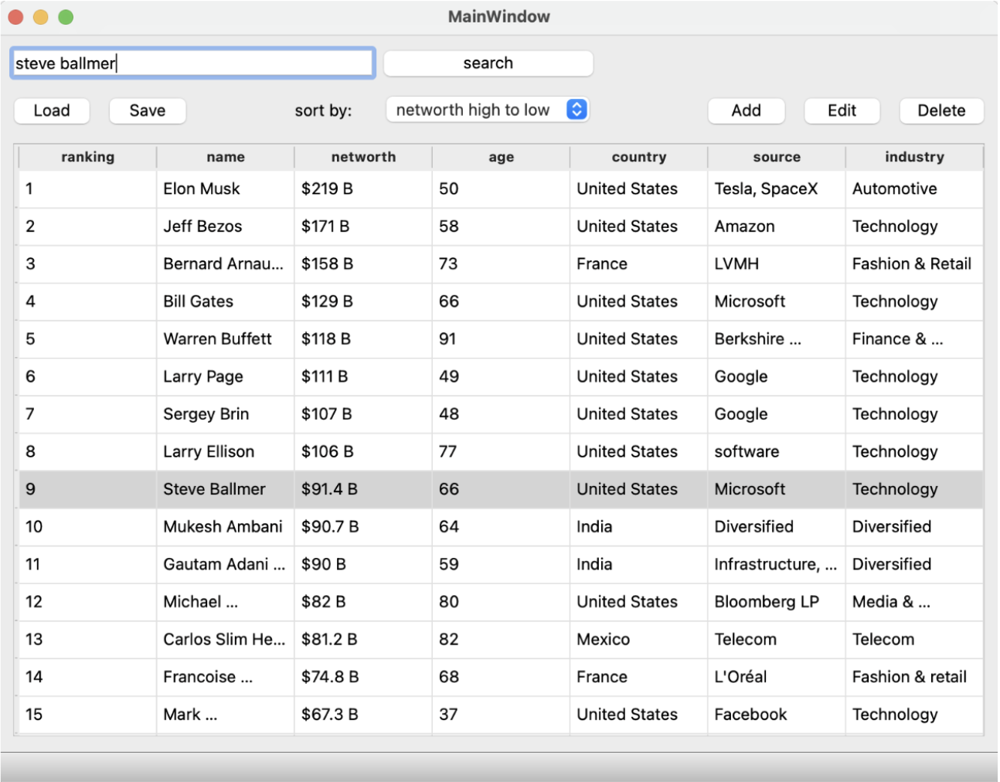

GUI приложение на C++

• Прототип приложения для управления данными из CSV таблицы, используя паттерн проектирования
Model-View-Controller (MVC). 

• Реализованы функции: добавление, редактирование, удаление данных, простой поиск, загрузка и сохранение данных в CSV файл.

• Отчет по проектуи более подробное описание в файле reportpr

